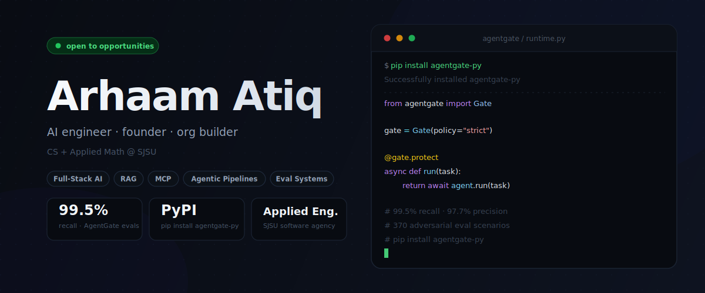
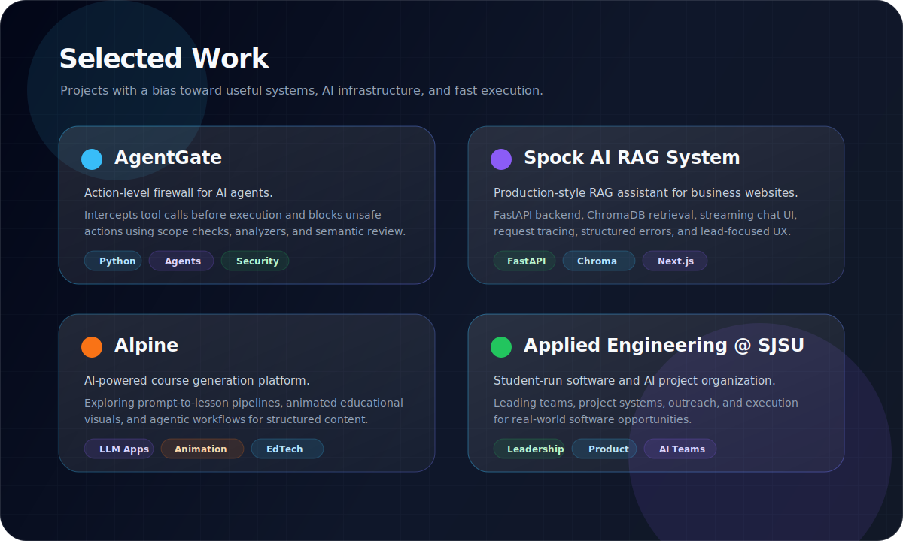

  

  
  
  
  

 

  

  CS + Applied Math @ <strong>SJSU</strong> · Open to software &amp; AI engineering roles

 

<table>
  <tr>
    <td width="50%" valign="top">
      <h3>What I build</h3>
      

        AI systems that ship. Recent work: <b>agentic pipelines</b>, <b>RAG with eval harnesses</b>,
        <b>MCP servers</b>, <b>LangGraph workflows</b>, and <b>agent safety infrastructure</b>.
        I care about production metrics, not just demos.
      

    </td>
    <td width="50%" valign="top">
      <h3>Right now</h3>
      

        Shipping <b>AgentGate</b> (on PyPI — <code>pip install agentgate-py</code>),
        building an MCP-powered infra planner with Bloom Energy, and leading
        <b>Applied Engineering @ SJSU</b>.
      

    </td>
  </tr>
</table>

---

 

<table>
  <tr>
    <td valign="top" width="50%">
      <b><a href="https://woozy-truffle-c53.notion.site/AgentGate-3493d8bd1185803ca682d58a73841fa6">AgentGate</a></b> — Action-layer firewall for AI agents. 
      99.5% recall · 97.7% precision · 370 adversarial evals · Published to PyPI 
      <code>Python</code> <code>LangChain</code> <code>OpenAI</code> <code>Evals</code>
    </td>
    <td valign="top" width="50%">
      <b><a href="https://woozy-truffle-c53.notion.site/HireSignal-AI-34a3d8bd11858030a338e18727d440d1">HireSignal</a></b> — Agentic pipeline decoding AI lab hiring patterns. 
      7-node LangGraph StateGraph · 0–100 AI intent scores · Full LangSmith tracing 
      <code>LangGraph</code> <code>FastAPI</code> <code>Tavily</code> <code>LangSmith</code>
    </td>
  </tr>
  <tr>
    <td valign="top">
      <b><a href="https://woozy-truffle-c53.notion.site/Customer-Service-RAG-Chatbot-34a3d8bd1185806f9c47d3fea1918dda">RAG Chatbot</a></b> — Production-grade RAG with automated RAGAS evals. 
      Faithfulness 0.83 · Relevancy 0.81 · Context recall 0.89 · Dockerized 
      <code>LangChain</code> <code>ChromaDB</code> <code>RAGAS</code> <code>Docker</code>
    </td>
    <td valign="top">
      <b><a href="https://woozy-truffle-c53.notion.site/DiscoverAI-34a3d8bd1185807b965af1ec95dedf24">DiscoverAI</a></b> — Company name → signal-grounded pitches in under 5 minutes. 
      First card streams in ~3s · SSE streaming · Used at Applied Engineering 
      <code>Next.js</code> <code>FastAPI</code> <code>LangChain</code> <code>SSE</code>
    </td>
  </tr>
  <tr>
    <td valign="top" colspan="2">
      <b>AI Infrastructure Deployment Planner</b> — MCP-powered planning system for AI workload deployment. Working with Bloom Energy. 
      Custom MCP server · Constraint graph across compute, power, cooling, permitting · Agentic reasoning over infra tradeoffs 
      <code>Next.js</code> <code>FastAPI</code> <code>MCP</code> <code>React Flow</code> <code>Claude</code>
    </td>
  </tr>
</table>

---

### Stack

  

   
  <code>LangGraph</code> &nbsp;<code>LangChain</code> &nbsp;<code>LangSmith</code> &nbsp;<code>ChromaDB</code> &nbsp;<code>RAGAS</code> &nbsp;<code>MCP</code> &nbsp;<code>OpenAI</code> &nbsp;<code>Claude</code>

---

### GitHub

  
  

 

  

---

  
Building something in AI, agents, or infrastructure? Let's talk.

  
  
  

 

